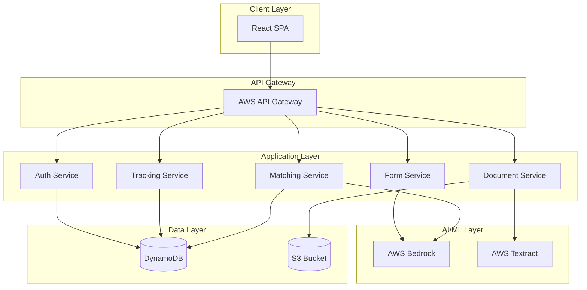

# Design Document: FormFlow

## Overview

FormFlow is a serverless, AI-powered web application built on AWS infrastructure that helps Indian college students navigate the complex scholarship application landscape. The system uses a microservices architecture with React frontend, FastAPI backend, AWS Bedrock for AI/ML capabilities, AWS Textract for document processing, and AWS Lambda for serverless compute.

The architecture follows a clear separation of concerns:
- **Presentation Layer**: React SPA for user interface
- **API Layer**: FastAPI REST API for business logic orchestration
- **AI/ML Layer**: AWS Bedrock for LLM-based matching and explanation
- **Document Processing Layer**: AWS Textract for OCR and data extraction
- **Data Layer**: DynamoDB for structured data, S3 for document storage
- **Compute Layer**: AWS Lambda for serverless function execution

## Architecture

### High-Level Architecture



### Service Architecture

The system is decomposed into five core microservices:

1. **Authentication Service**: Handles user registration, login, session management, and password reset
2. **Document Service**: Manages document upload, storage, parsing, and data extraction
3. **Matching Service**: Performs scholarship eligibility matching using AI
4. **Form Service**: Auto-fills application forms and performs validation
5. **Tracking Service**: Monitors and displays application status

Each service is deployed as AWS Lambda functions behind API Gateway, enabling independent scaling and deployment.

## Components and Interfaces

### 1. Authentication Service

**Responsibilities:**
- User registration and login
- Session management with JWT tokens
- Password reset functionality
- Profile management

**Key Interfaces:**

```python
class AuthService:
    def register_user(email: str, mobile: str, password: str, language: str) -> UserProfile
    def login(email: str, password: str) -> AuthToken
    def verify_token(token: str) -> UserProfile
    def reset_password(email: str) -> bool
    def update_profile(user_id: str, updates: dict) -> UserProfile
```

**Dependencies:**
- DynamoDB: User profile storage
- AWS SES: Email notifications

### 2. Document Service

**Responsibilities:**
- Document upload and validation
- Integration with AWS Textract for OCR
- Data extraction and confidence scoring
- Document storage in S3

**Key Interfaces:**

```python
class DocumentService:
    def upload_document(user_id: str, file: bytes, doc_type: str) -> DocumentMetadata
    def parse_document(document_id: str) -> ExtractedData
    def verify_extraction(document_id: str, corrections: dict) -> ExtractedData
    def get_document(document_id: str) -> bytes
    def delete_document(document_id: str) -> bool

class TextractParser:
    def extract_aadhaar(document: bytes) -> AadhaarData
    def extract_marksheet(document: bytes) -> MarksheetData
    def extract_income_certificate(document: bytes) -> IncomeCertificateData
```

**Dependencies:**
- AWS Textract: OCR and data extraction
- S3: Document storage
- DynamoDB: Document metadata

### 3. Matching Service

**Responsibilities:**
- Scholarship eligibility matching
- AI-powered ranking and recommendations
- Eligibility criteria evaluation
- "Nearly eligible" detection

**Key Interfaces:**

```python
class MatchingService:
    def find_eligible_scholarships(user_profile: UserProfile) -> List[ScholarshipMatch]
    def rank_scholarships(matches: List[ScholarshipMatch]) -> List[ScholarshipMatch]
    def check_eligibility(user_profile: UserProfile, scholarship: Scholarship) -> EligibilityResult
    def explain_ineligibility(user_profile: UserProfile, scholarship: Scholarship) -> str

class ScholarshipDatabase:
    def get_all_scholarships() -> List[Scholarship]
    def get_scholarship(scholarship_id: str) -> Scholarship
    def update_scholarship(scholarship_id: str, updates: dict) -> Scholarship
    def search_scholarships(criteria: dict) -> List[Scholarship]
```

**Dependencies:**
- AWS Bedrock: LLM for intelligent matching
- DynamoDB: Scholarship database
- DynamoDB: User profiles

### 4. Form Service

**Responsibilities:**
- Auto-fill application forms
- Pre-submission validation
- Error detection and reporting
- Form data persistence

**Key Interfaces:**

```python
class FormService:
    def auto_fill_form(user_profile: UserProfile, scholarship_id: str) -> ApplicationForm
    def validate_form(form: ApplicationForm) -> ValidationResult
    def save_draft(user_id: str, form: ApplicationForm) -> str
    def submit_application(user_id: str, form: ApplicationForm) -> ApplicationSubmission

class ErrorChecker:
    def check_required_fields(form: ApplicationForm) -> List[ValidationError]
    def check_format_errors(form: ApplicationForm) -> List[ValidationError]
    def check_eligibility_match(form: ApplicationForm, scholarship: Scholarship) -> List[ValidationError]
```

**Dependencies:**
- DynamoDB: Form drafts and submissions
- Matching Service: Eligibility verification

### 5. Tracking Service

**Responsibilities:**
- Application status monitoring
- Status update notifications
- Timeline tracking
- Dashboard data aggregation

**Key Interfaces:**

```python
class TrackingService:
    def get_applications(user_id: str) -> List[Application]
    def get_application_details(application_id: str) -> ApplicationDetails
    def update_status(application_id: str, status: str) -> Application
    def get_timeline(application_id: str) -> List[StatusEvent]
    def send_notification(user_id: str, message: str) -> bool

class RejectionExplainer:
    def explain_rejection(rejection_reason: str, language: str) -> str
    def get_action_steps(rejection_reason: str, language: str) -> List[str]
```

**Dependencies:**
- AWS Bedrock: LLM for rejection explanation
- DynamoDB: Application records
- AWS SNS: Push notifications

## Data Models

### User Profile

```python
class UserProfile:
    user_id: str
    email: str
    mobile: str
    password_hash: str
    language: str  # "hi" or "en"
    created_at: datetime
    updated_at: datetime
    
    # Extracted from documents
    aadhaar_number: str
    name: str
    date_of_birth: date
    address: str
    
    # Academic information
    institution_name: str
    course: str
    academic_year: str
    marks: dict  # subject -> marks mapping
    
    # Financial information
    family_income: float
    income_certificate_validity: date
    
    # Additional eligibility factors
    caste_category: str
    state: str
    disability_status: bool
```

### Scholarship

```python
class Scholarship:
    scholarship_id: str
    name: str
    portal: str  # "NSP" or state portal name
    benefit_amount: float
    deadline: date
    description: str
    
    # Eligibility criteria
    min_marks: float
    max_income: float
    eligible_categories: List[str]
    eligible_states: List[str]
    eligible_courses: List[str]
    age_range: tuple  # (min_age, max_age)
    
    # Metadata
    created_at: datetime
    updated_at: datetime
    is_active: bool
```

### Application Form

```python
class ApplicationForm:
    form_id: str
    user_id: str
    scholarship_id: str
    status: str  # "draft", "submitted", "approved", "rejected"
    
    # Form fields (varies by scholarship)
    fields: dict  # field_name -> field_value mapping
    
    # Metadata
    created_at: datetime
    updated_at: datetime
    submitted_at: datetime
    
    # Validation
    validation_errors: List[ValidationError]
    is_valid: bool
```

### Document Metadata

```python
class DocumentMetadata:
    document_id: str
    user_id: str
    document_type: str  # "aadhaar", "marksheet", "income_certificate"
    s3_key: str
    file_size: int
    upload_date: datetime
    
    # Extraction results
    extracted_data: dict
    confidence_scores: dict  # field -> confidence mapping
    needs_verification: bool
```

### Scholarship Match

```python
class ScholarshipMatch:
    scholarship: Scholarship
    eligibility_score: float  # 0.0 to 1.0
    is_eligible: bool
    is_nearly_eligible: bool
    missing_criteria: List[str]
    match_reasons: List[str]
```

### Validation Error

```python
class ValidationError:
    field_name: str
    error_type: str  # "missing", "format", "eligibility"
    message: str
    expected_format: str
    severity: str  # "error", "warning"
```


## Correctness Properties

A property is a characteristic or behavior that should hold true across all valid executions of a system—essentially, a formal statement about what the system should do. Properties serve as the bridge between human-readable specifications and machine-verifiable correctness guarantees.

### Document Processing Properties

**Property 1: Complete field extraction from documents**
*For any* valid document of a supported type (Aadhaar, marksheet, income certificate), parsing the document should extract all required fields specific to that document type (Aadhaar: 12-digit number, name, DOB, address; Marksheet: institution, course, marks, year; Income Certificate: amount, authority, validity).
**Validates: Requirements 1.1, 1.2, 1.3**

**Property 2: Language-specific error messages**
*For any* document upload failure and any language preference, the error message returned should be in the student's selected language.
**Validates: Requirements 1.4**

**Property 3: Document storage with encryption**
*For any* successfully uploaded document, retrieving it from S3 should return the same document content, and the stored object should have encryption metadata indicating AES-256 encryption.
**Validates: Requirements 1.5, 10.1**

**Property 4: Unsupported format rejection**
*For any* document with an unsupported file format (not PDF, JPG, or PNG), the upload should be rejected and the error message should list the supported formats.
**Validates: Requirements 1.6**

**Property 5: Low-confidence field flagging**
*For any* document extraction result, all fields with confidence scores below 80% should be flagged for manual review.
**Validates: Requirements 2.3**

**Property 6: Data correction persistence**
*For any* extracted data correction made by a student, immediately retrieving the profile should return the corrected value, not the original extracted value.
**Validates: Requirements 2.5**

### Scholarship Matching Properties

**Property 7: Complete eligibility matching**
*For any* complete student profile and scholarship database, the matching service should return all scholarships where the student meets all eligibility criteria (academic performance, income, caste, state, course).
**Validates: Requirements 3.1, 3.2**

**Property 8: Benefit amount ranking**
*For any* list of eligible scholarships, the results should be ordered in descending order by benefit amount.
**Validates: Requirements 3.3**

**Property 9: Nearly eligible detection**
*For any* student profile and scholarship where the student fails exactly one eligibility criterion by less than 10% (e.g., marks 68% when 70% required, income ₹2.2L when ₹2L required), the scholarship should be marked as "nearly eligible".
**Validates: Requirements 3.4**

**Property 10: Required information display**
*For any* scholarship match displayed to a student, the rendered output should contain the scholarship name, benefit amount, deadline, and eligibility summary.
**Validates: Requirements 3.6**

### Form Auto-Fill Properties

**Property 11: Profile field mapping**
*For any* scholarship application form and complete student profile, all form fields that have corresponding profile fields should be auto-filled with the profile values.
**Validates: Requirements 4.1**

**Property 12: Unfillable field identification**
*For any* scholarship application form and student profile, all required form fields that cannot be filled from the profile should be identified and flagged for manual input.
**Validates: Requirements 4.2**

**Property 13: User modification preservation**
*For any* auto-filled form field that a student modifies, subsequent auto-fill operations should not overwrite the student's modification.
**Validates: Requirements 4.4**

**Property 14: Cross-form data reuse**
*For any* two scholarship applications by the same student, if both forms have a field with the same name and the student filled it in the first form, the second form should auto-fill that field with the same value.
**Validates: Requirements 4.5**

### Validation Properties

**Property 15: Required field validation**
*For any* application form, validation should identify all required fields that are empty or null.
**Validates: Requirements 5.1, 5.2**

**Property 16: Format error detection**
*For any* application form with fields that have format requirements (e.g., email, phone, date), validation should detect all fields that don't match their expected format.
**Validates: Requirements 5.3**

**Property 17: Eligibility mismatch warning**
*For any* application form where the student's profile doesn't meet the scholarship's eligibility criteria, validation should generate a warning before allowing submission.
**Validates: Requirements 5.4**

**Property 18: Invalid submission prevention**
*For any* application form with validation errors, attempting to submit should be blocked until all errors are corrected.
**Validates: Requirements 5.6**

### Rejection Explanation Properties

**Property 19: Rejection reason retrieval**
*For any* rejected application with a rejection reason stored in the system, the explainer should retrieve and process that reason.
**Validates: Requirements 6.1**

**Property 20: Language-appropriate explanations**
*For any* rejection reason and student language preference, the explanation should be generated in the student's selected language (Hindi or English).
**Validates: Requirements 6.2**

**Property 21: Missing document identification**
*For any* rejection due to missing documents, the explanation should list all specific documents that are required.
**Validates: Requirements 6.4**

**Property 22: Eligibility criteria explanation**
*For any* rejection due to eligibility criteria, the explanation should identify which specific criteria were not met.
**Validates: Requirements 6.5**

### Status Tracking Properties

**Property 23: Complete application listing**
*For any* student with submitted applications, the dashboard should display all applications with their current status.
**Validates: Requirements 7.1**

**Property 24: Action-required highlighting**
*For any* application that requires student action, the status tracker should flag it with a notification indicator.
**Validates: Requirements 7.3**

**Property 25: Status information completeness**
*For any* application displayed in the status tracker, the display should include submission date, current stage, and expected decision date.
**Validates: Requirements 7.4**

**Property 26: Complete timeline display**
*For any* application, the detailed view should show all status changes in chronological order.
**Validates: Requirements 7.5**

### Multi-Language Properties

**Property 27: Language consistency**
*For any* student with a selected language preference, all interface text, scholarship content, and error messages should be displayed in that language.
**Validates: Requirements 8.2, 8.4, 8.5**

**Property 28: Language switching without data loss**
*For any* student who changes language preference while working on a form, the form data should remain unchanged and only the interface text should update.
**Validates: Requirements 8.3**

### Authentication Properties

**Property 29: Registration field requirements**
*For any* registration attempt, the system should reject it if any of the required fields (email, mobile, password) are missing.
**Validates: Requirements 9.1**

**Property 30: Password strength validation**
*For any* password that is shorter than 8 characters or lacks at least one number and one special character, the system should reject it with a descriptive error.
**Validates: Requirements 9.2**

**Property 31: Valid credential authentication**
*For any* login attempt with correct email and password, the system should create a session token that can be used to access protected resources.
**Validates: Requirements 9.3**

**Property 32: Password reset email delivery**
*For any* password reset request with a registered email, the system should send a reset link to that email address.
**Validates: Requirements 9.5**

**Property 33: Profile update triggers re-matching**
*For any* student profile update that changes eligibility-relevant fields (marks, income, state, etc.), the system should automatically trigger scholarship re-matching.
**Validates: Requirements 9.6**

### Security Properties

**Property 34: Complete data deletion**
*For any* student account deletion, all associated documents, profile data, and application records should be removed from the system.
**Validates: Requirements 10.3**

**Property 35: Sensitive operation authentication**
*For any* sensitive operation (document deletion, profile deletion, password change), the system should require valid authentication before allowing the operation.
**Validates: Requirements 10.5**

**Property 36: Document access logging**
*For any* document access operation (view, download, delete), the system should create an audit log entry with timestamp, user ID, and operation type.
**Validates: Requirements 10.6**

### Scholarship Database Properties

**Property 37: Criteria update propagation**
*For any* scholarship eligibility criteria change, all affected student profiles should be re-evaluated and students should receive notifications if their eligibility status changed.
**Validates: Requirements 11.2**

**Property 38: Inactive scholarship exclusion**
*For any* scholarship marked as inactive, it should not appear in eligibility matching results for any student.
**Validates: Requirements 11.5**

## Error Handling

### Error Categories

1. **Validation Errors**: User input that doesn't meet requirements
   - Missing required fields
   - Invalid format (email, phone, date)
   - File size/type violations
   - Password strength violations

2. **Business Logic Errors**: Operations that violate business rules
   - Ineligible scholarship applications
   - Duplicate submissions
   - Expired deadlines

3. **External Service Errors**: Failures from AWS services
   - Textract parsing failures
   - Bedrock API errors
   - S3 upload/download failures
   - DynamoDB connection issues

4. **Authentication Errors**: Security-related failures
   - Invalid credentials
   - Expired sessions
   - Insufficient permissions

### Error Handling Strategy

**Validation Errors:**
- Return 400 Bad Request with detailed field-level errors
- Include error messages in user's selected language
- Provide expected format examples

**Business Logic Errors:**
- Return 422 Unprocessable Entity with explanation
- Suggest corrective actions when possible
- Log for analytics to improve UX

**External Service Errors:**
- Implement exponential backoff retry (3 attempts)
- Return 503 Service Unavailable if all retries fail
- Log errors to CloudWatch for monitoring
- Provide user-friendly error messages (hide technical details)

**Authentication Errors:**
- Return 401 Unauthorized for invalid credentials
- Return 403 Forbidden for insufficient permissions
- Clear client-side session on authentication failure

### Error Response Format

```python
class ErrorResponse:
    error_code: str  # Machine-readable error code
    message: str  # Human-readable message in user's language
    field_errors: dict  # Field-specific errors for validation
    suggested_action: str  # What the user should do next
    timestamp: datetime
```

## Testing Strategy

### Dual Testing Approach

FormFlow requires both unit tests and property-based tests for comprehensive coverage:

- **Unit tests**: Verify specific examples, edge cases, and error conditions
- **Property tests**: Verify universal properties across all inputs

Both approaches are complementary and necessary. Unit tests catch concrete bugs in specific scenarios, while property tests verify general correctness across a wide range of inputs.

### Property-Based Testing

**Framework**: Use `hypothesis` for Python (FastAPI backend) and `fast-check` for TypeScript (React frontend)

**Configuration**:
- Minimum 100 iterations per property test (due to randomization)
- Each test must reference its design document property
- Tag format: `# Feature: formflow, Property {number}: {property_text}`

**Property Test Implementation**:
- Each correctness property listed above must be implemented as a single property-based test
- Tests should generate random valid inputs (profiles, documents, forms)
- Tests should verify the property holds for all generated inputs

**Example Property Test Structure**:

```python
from hypothesis import given, strategies as st

@given(
    profile=st.builds(UserProfile),
    scholarships=st.lists(st.builds(Scholarship), min_size=1)
)
def test_complete_eligibility_matching(profile, scholarships):
    """
    Feature: formflow, Property 7: Complete eligibility matching
    For any complete student profile and scholarship database,
    the matching service should return all scholarships where
    the student meets all eligibility criteria.
    """
    matches = matching_service.find_eligible_scholarships(profile)
    
    # Verify all eligible scholarships are returned
    for scholarship in scholarships:
        is_eligible = check_all_criteria(profile, scholarship)
        if is_eligible:
            assert scholarship.scholarship_id in [m.scholarship.scholarship_id for m in matches]
```

### Unit Testing

**Focus Areas**:
- Specific document parsing examples (sample Aadhaar, marksheet, income certificate)
- Edge cases: empty documents, malformed data, boundary values
- Error conditions: network failures, invalid tokens, missing data
- Integration points: API endpoints, database operations, S3 interactions

**Unit Test Balance**:
- Avoid writing too many unit tests for scenarios covered by property tests
- Focus unit tests on concrete examples that demonstrate correct behavior
- Use unit tests for integration testing between components

### Test Coverage Goals

- **Code Coverage**: Minimum 80% line coverage
- **Property Coverage**: All 38 correctness properties implemented as property tests
- **Edge Case Coverage**: All edge cases identified in prework analysis
- **Integration Coverage**: All API endpoints and service interactions

### Testing Infrastructure

**Backend Testing**:
- pytest for unit tests
- hypothesis for property-based tests
- pytest-asyncio for async test support
- moto for AWS service mocking

**Frontend Testing**:
- Jest for unit tests
- fast-check for property-based tests
- React Testing Library for component tests
- MSW for API mocking

**CI/CD Integration**:
- Run all tests on every pull request
- Block merges if tests fail or coverage drops
- Run property tests with increased iterations (1000) in nightly builds
